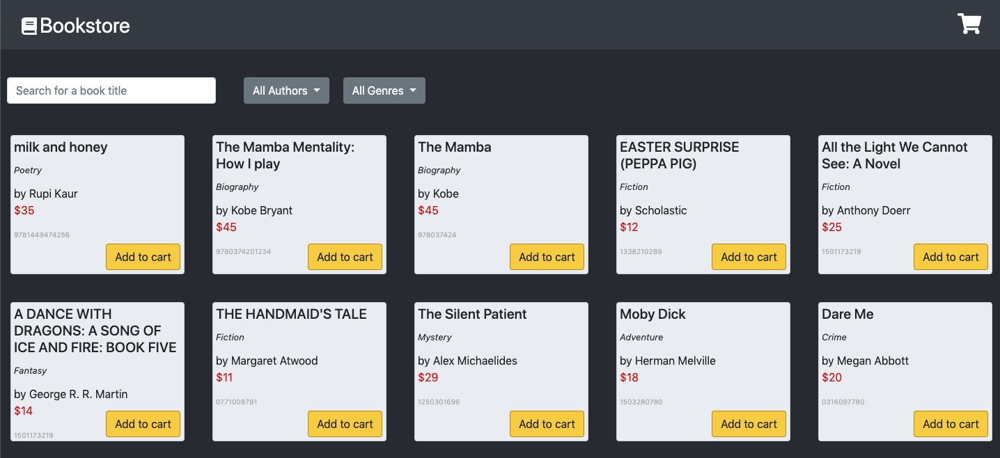
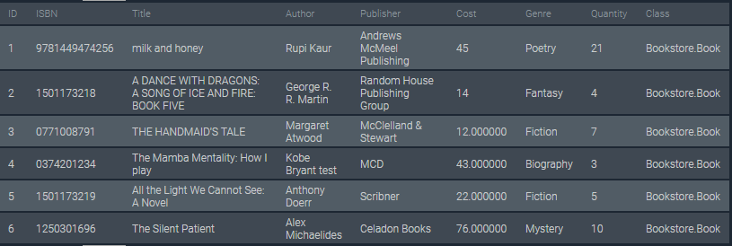
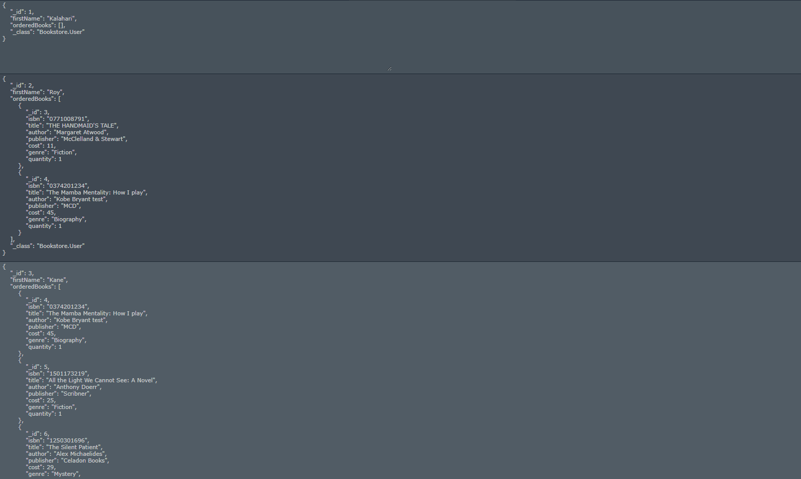
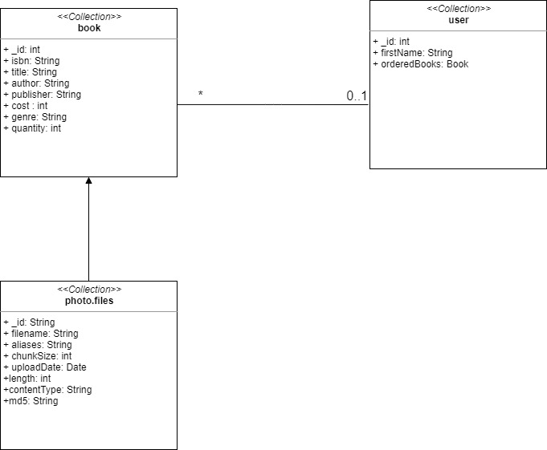

# online-bookstore
[](https://travis-ci.com/gurveerdhindsa/online-bookstore)

### https://amazin-online-bookstore.herokuapp.com/

<p align="center">
  
</p>

>Bookstore Owner can upload and edit Book information (ISBN, picture, description, author, publisher,...) and inventory. User can search for, and browse through, the books in the Bookstore, sort/filter them based on the above information. User can then decide to purchase one or many books by putting them in the Shopping Cart and proceeding to Checkout. The purchase itself will obviously be simulated, but purchases cannot exceed the inventory. User can also view Book Recommendations based on past purchases. This is done by looking for users whose purchases are most similar (using Jaccard distance: Google it!), and then recommending books purchased by those similar users but that the current User hasn't yet purchased.

## Getting Started
These instructions will get you a copy of the project up and running on your local machine for development and testing purposes.

### Prerequisites
For building and running the application you need:
- [JDK 1.8](http://www.oracle.com/technetwork/java/javase/downloads/jdk8-downloads-2133151.html)
- [Maven 3](https://maven.apache.org)

### Installing
First, clone this repository to your local machine using `https://github.com/gurveerdhindsa/online-bookstore.git`

### Running the application locally
Option 1:
- Execute the main method in src/main/java/Repository/Launcher.java

Option 2:
```
mvn spring-boot:run
```

## Running the tests
```
mvn test
```

## Built With
* [Spring Boot](https://spring.io/projects/spring-boot) - The web framework used
* [Maven](https://maven.apache.org/) - Dependency Management

## Kanban
#### Current state
##### Milestone 1
The application is integrated with Travis CI and running a production build on Heroku. The application displays a collection of books which is fetched from a NoSQL database. Currently, there is enough functionality to get a feel for how the system will work. On the frontend, there is a search engine, and filters the displayed books. There are author and genre filters that are populated based on all books in the bookstore. On the backend, there is an endpoint in place to return every book and its attributes.
##### Milestone 2
Currently, the user view of the application is fully functional. The user can search, and filter through the various books in the bookstore. The search engine takes in the title of a book and displays every book that matches the criteria. In addition, there are genre and author filters in place. On the backend, there /title endpoint was upgraded to accomodate the other filters. The inventory of each book is verified prior to adding the item to the shopping cart and the checkout phase is fully functional. User and transactions are added in the Users database table.

As for the feedback from Milestone 1, we have created a UML diagram and removed UI components that do not have functionality. Also, we pass database credentials via environment variables on Heroku/Travis CI.

#### Milestone 3
In the final milestone, the admin view is fully developed. This view allows an admin to modify attributes of each book in the bookstore. The recommendations for a specific user is calculated and displayed accordingly in the web application.

## Database Schema
#### Books database schema


#### User database schema


## Demo
### Logging in
To begin, please visit our hosted web application at https://amazin-online-bookstore.herokuapp.com/. Upon visiting the application, the user is prompted for their ID. Our group decided to use an ID as a way to identify certain users in the bookstore system. An ID can be any number and the admin ID is 1. Note, we decided to use a simple prompt instead of a fully functional login system to differentiate between users as login security is outside the scope of this course.

### Viewing the books
Upon entering an ID, the user is shown the homepage of the application. This page consists of a shopping cart, book title search engine, author filter, genre filter and a collection of books. The collection of books displays every book in the bookstore. Each book displays its title, genre, author, price and ISBN. The reccomended books for the 'logged in' user is displayed in red tint.

### Purchasing books
To purchase a book, the 'Add to cart' button must be clicked. In some cases, the quantity of a book may be minimal. If that is the case, the button is disabled and indicates it is out of stock. When the user is satisfied with their selection of books, the shopping cart icon in the top right of the page can be clicked. This brings up a dropdown consisting of the selections made. If a user had accidentally added something to their cart, they can remove the item in this dropdown. When ready to checkout their items, the user can click the 'Checkout' button. Upon a successful checkout, a prompt is displayed indicating whether or not the purchase was successful.

### Filtering books
To filter the entire set of books in the bookstore, the user can search for a book title, filter through authors or filter through genres. These 3 filters work together in conjunction, to assist our users in finding the book they are searching for!

### Admin view
To access the admin view, an ID of 1 must be used upon first visiting the web application. As mentioned before, our group used this as a means to replace a complicated login system that is outside the scope of this course. The admin is shown a view similar to the general user view. In addition, the admin has the responsibility of modifying each book. This can be done by clicking on the pencil icon in the bottom left corner of a respective book. Upon clicking this icon, a form will be displayed to the admin where they can modify any attribute of the book. Upon submitting the changes, a prompt is displayed indicating whether or not the book edit was successful. If it was successful, the changes are immediately reflected in the bookstore homepage. 

### Endpoints
Admin Controller Endpoints:
/admin/{id}: validates the id to check whether an admin (1) is accessing the page or a user &nbsp;
/admin/add: an admin adds a new book to the bookstore, with the required attributes of title, author, publisher, genre, cost and inventory
&nbsp;
/update: admin can update the attributes of an existing book
&nbsp;
/delete/{isbn}: admin can delete an existing book

Book Controller Endpoints:
&nbsp;
/books: returns all the books in the bookstore on the web page
&nbsp;
/filter: a user can search a book using the title, author or the genre

User Controller Endpoints: 
/user/{id}/recommended: recommends books looking at what books other users have purchased
&nbsp;
/checkout: purchases the books the user has added in their cart

#### UML Diagram 


## Authors
* **Abubakar Abdulsalam**
* **Gurveer Dhindsa**
* **Rohan Katkar**

## Acknowledgments
* README inspiration from [PurpleBooth](https://gist.github.com/PurpleBooth/109311bb0361f32d87a2)
